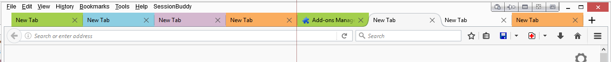
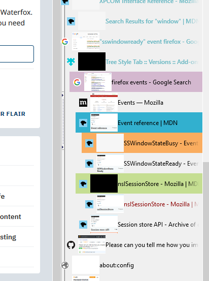

# highlightTab

highlight your tabs in color for better tab management 

ctrl or shift click on a tab and highlight it ... click again to remove color 

has additional contextmenu with more colors

supports sessionrestore perfectly and aslo the well known addon sessionmanager with all its restore modes, should also support webext session-managers(not tested) 

works nicely with treestyletabs 

